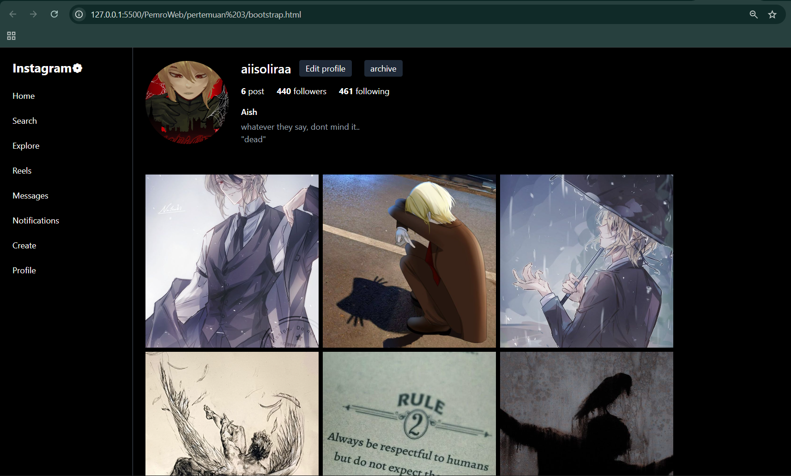
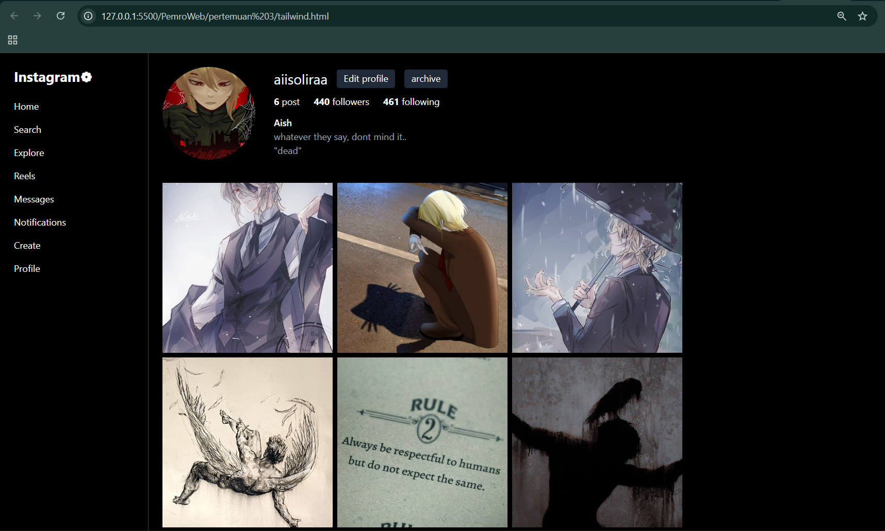

## Tailwind CSS?

Tailwind CSS itu framework CSS yang **berbasis utility class**. Jadi, kita nggak perlu bikin banyak CSS manual, tapi cukup pakai kelas-kelas kecil yang sudah disediakan untuk styling. Contohnya, kalau mau kasih background hitam, tinggal pakai kelas `bg-black`. Kalau mau kasih padding, tinggal pakai `p-6`, dsb.

Kelebihan Tailwind:
- Cepat bikin tampilan karena tinggal pakai kelas siap pakai.
- Fleksibel dan mudah dikustomisasi.
- Cocok buat yang suka ngoding cepat dan modular.

## Bootstrap CSS?

Bootstrap CSS adalah framework CSS yang sudah lama dan sangat populer. Ini menyediakan:

- Komponen siap pakai seperti tombol, navbar, grid system, dan lain-lain.
- Sistem grid yang memudahkan bikin layout responsif.
- Styling default yang rapi dan konsisten.

## Implementasi Tailwind CSS

Pada versi Tailwind CSS, styling dilakukan dengan menggunakan kelas-kelas utility yang disediakan oleh Tailwind. 

Contoh:
- `bg-black` untuk background hitam.
- `text-white` untuk warna teks putih.
- `flex`, `space-x-8`, `grid grid-cols-3 gap-2` untuk layout fleksibel dan grid.
- `rounded-full`, `border-4 border-pink-500` untuk styling foto profil.

Keuntungan menggunakan Tailwind adalah kemudahan dalam mengatur styling langsung di HTML tanpa perlu menulis CSS terpisah. Hal ini mempercepat proses pengembangan dan memudahkan penyesuaian tampilan.

## Implementasi Bootstrap CSS

Versi Bootstrap menggunakan framework Bootstrap 5 yang menyediakan sistem grid dan komponen siap pakai. Struktur halaman menggunakan:

- Kelas `d-flex`, `flex-column`, `gap-3` untuk layout sidebar dan konten.
- Grid Bootstrap dengan `row row-cols-3 g-2` untuk galeri foto.
- Tombol dengan styling kustom menggunakan kelas `.btn-custom` yang didefinisikan di file CSS terpisah.

Karena Bootstrap menggunakan pendekatan komponen dan grid, styling tambahan seperti warna latar dan border dibuat di file CSS eksternal (`styles-bootstrap.css`). Hal ini membuat kode HTML lebih bersih dan terstruktur.

## Struktur

1. **Tailwind CSS**  
   - HTML menggunakan kelas-kelas Tailwind untuk styling.  
   - Warna gelap (dark mode) dengan background hitam dan teks putih.  
   - Sidebar navigasi, profil pengguna, dan galeri foto.

2. **Bootstrap CSS**  
   - HTML menggunakan kelas Bootstrap untuk layout dan styling dasar.  
   - CSS tambahan di file terpisah (`styles.css`) untuk kustom warna dan ukuran.  
   - Layout dan fitur mirip versi Tailwind.

## File

- `tailwind.html` — halaman dengan Tailwind CSS (langsung pakai CDN Tailwind).  
- `bootstrap.html` — halaman dengan Bootstrap CSS.  
- `styles.css` — file CSS khusus untuk styling tambahan di versi Bootstrap.  
- Folder `foto/` — berisi gambar profil dan foto postingan yang dipakai di halaman.

- **Tailwind CSS** ngajarin cara styling yang sangat modular dan cepat, cocok buat yang suka custom desain.  
- **Bootstrap CSS** ngajarin cara bikin layout dan komponen dengan cepat dan konsisten, cocok buat prototyping dan proyek yang butuh standar UI.  
- Dengan belajar keduanya, kita jadi lebih fleksibel dan paham berbagai cara bikin tampilan web.

Halaman profil Instagram yang dibuat terdiri dari beberapa bagian utama:
- Bagian profil pengguna yang menampilkan foto profil, tombol edit, statistik postingan, followers, dan following.
- Bio singkat pengguna.
- Galeri foto dengan layout grid 3 kolom dan rasio aspek 1:1.

ini hasil dari bootstrap dan tailwind saya:
## Bootstrap

## Tailwind
